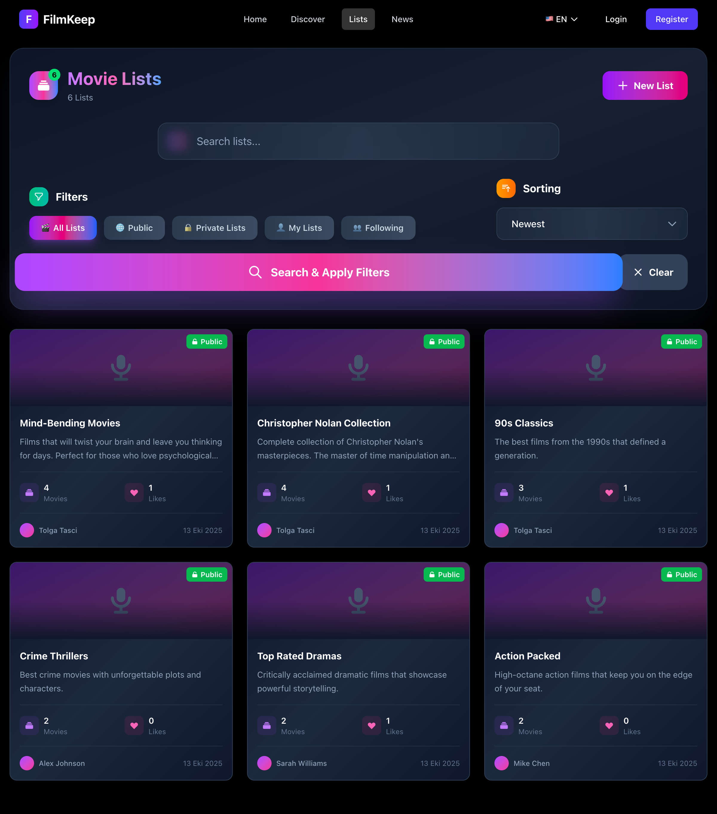
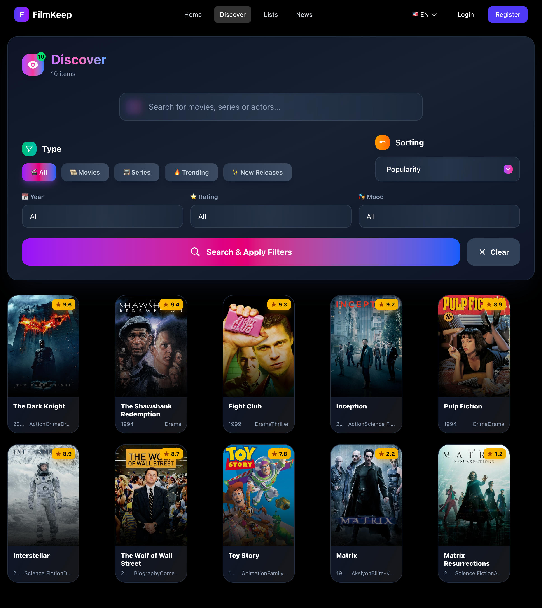
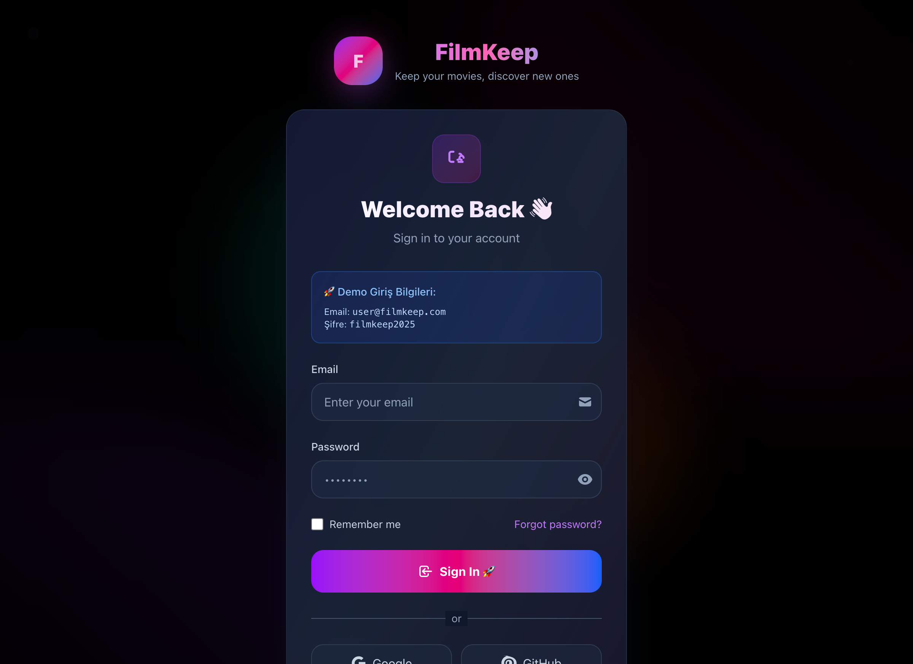

  

<h1 align="center">FilmKeep</h1>

  <strong>Filmlerinizi Saklayin, Yenilerini Kesfedin</strong>

  <a href="./README.md">🇺🇸 English</a> |
  <a href="./README.tr.md">🇹🇷 Türkçe</a>

  
  

---

## Ekran Goruntuleri

📸 <strong>Ana Sayfa</strong> - Kapatmak icin tiklayin

 

  

<em>Trend filmler ve kisisellestirilmis oneriler</em>

🎬 <strong>Film Detay</strong> - Gormek icin tiklayin

 

  

<em>Zengin metadata, puanlar, yorumlar ve sosyal ozellikler</em>

📋 <strong>Listeler</strong> - Gormek icin tiklayin

 

  

<em>Film koleksiyonlarinizi olusturun ve yonetin</em>

🔍 <strong>Kesfet</strong> - Gormek icin tiklayin

 

  

<em>Gelismis filtreleme ve arama</em>

🔐 <strong>Giris</strong> - Gormek icin tiklayin

 

  

<em>OAuth destekli guzel giris sayfasi (Google, GitHub)</em>

📱 <strong>Mobil Gorunum</strong> - Gormek icin tiklayin

 

  

<em>Tam responsive PWA-hazir tasarim</em>

---

## FilmKeep Nedir?

**FilmKeep**, **Letterboxd**'un sosyal ozelliklerini **IMDb**'nin zengin veri yapisiyla birlestiren modern, production-ready bir film ve dizi kesif platformudur.

Kurumsal duzey teknoloji (Laravel 12 + React 19) ile gelistirilen FilmKeep, **250+ ozellik**, **22 veritabani tablosu**, **100+ API endpoint** ve **40+ React component** sunmaktadir.

---

## Platform Istatistikleri

| Metrik | Deger |
|--------|-------|
| Toplam Ozellik | 250+ |
| Veritabani Tablosu | 22 |
| API Endpoint | 100+ |
| React Component | 40+ |
| Web Sayfasi | 30+ |
| Kod Satiri | ~90,000 |
| Dil Destegi | Turkce & Ingilizce |

---

## Tum Ozellikler

### 🔐 Kimlik Dogrulama & Hesap (15+ ozellik)

- **Kullanici Kaydi** - E-posta tabanli kayit ve dogrulama
- **Kullanici Girisi** - E-posta & sifre ile oturum yonetimi
- **Sosyal OAuth** - Google, GitHub, Apple (altyapi hazir)
- **Sifre Sifirlama** - E-posta dogrulama ile sifre kurtarma
- **JWT Kimlik Dogrulama** - Laravel Sanctum ile API token
- **Oturum Yonetimi** - Kalici oturumlar ve aktivite takibi
- **E-posta Dogrulama** - Hesap dogrulama is akisi
- **Iki Faktorlu Dogrulama** - 2FA destegi (altyapi hazir)
- **Beni Hatirla** - Uzun sureli oturum
- **Cikis Yap** - Guvenli oturum sonlandirma
- **Sifre Degistirme** - Sifre guncelleme
- **Hesap Silme** - GDPR uyumlu hesap kaldirma

### 👤 Kullanici Profilleri (15+ ozellik)

- **Profil Olusturma** - Tam kullanici profili kurulumu
- **Profil Duzenleme** - Ad, kullanici adi, bio, konum, website
- **Avatar Yukleme** - Profil resmi ve otomatik avatar
- **Bio Bolumu** - Kisisel aciklama ve bilgiler
- **Konum & Website** - Ek profil metadata
- **Kullanici Adi Yonetimi** - Benzersiz kullanici adi kontrolu
- **Hesap Ayarlari** - Tercih yonetimi ve ozellestirme
- **Abonelik Kademeleri** - Ucretsiz, Pro, Premium
- **Kullanici Istatistikleri** - Saklanan film, liste, takipci sayisi
- **Son Aktivite Takibi** - Gercek zamanli aktivite durumu
- **Herkese Acik Profiller** - Diger kullanicilarin koleksiyonlari
- **Profil Gizliligi** - Profil gorunurluk kontrolu

### 🎬 Saklama Ozelligi - Temel Islevsellik (10+ ozellik)

- **Tek Tikla Sakla** - Filmleri aninda koleksiyona ekle
- **Saklamayi Kaldir** - Koleksiyondan cikar
- **Saklama Sayaci** - Toplam saklanan film takibi
- **Kademe Limitleri** - Ucretsiz: 100 film, Pro/Premium: Sinirsiz
- **Saklama Notlari** - Saklarken kisisel not ekle
- **Saklama Durumu Kontrolu** - Film saklanmis mi kontrol et
- **Toplu Saklama** - Birden fazla filmi tek seferde sakla
- **Saklama Gecmisi** - Filmlerin ne zaman saklandi takibi
- **Saklama Kategorileri** - Saklanan filmleri organize et
- **Saklanan Filmleri Disari Aktar** - Koleksiyonunuzu indirin

### 📋 Listeler & Koleksiyonlar (20+ ozellik)

- **Liste Olustur** - Temali kullanici koleksiyonlari
- **Liste Duzenle** - Baslik, aciklama, kapak resmi degistir
- **Liste Sil** - Koleksiyonlari kaldir
- **Surukle-Birak Siralama** - dnd-kit ile film siralama
- **Listeye Film Ekle** - Koleksiyonlarinizi olusturun
- **Listeden Cikar** - Secimlerinizi duzenleyin
- **Liste Notlari** - Her liste ogesine not ekle
- **Listeler Arasi Tasima** - Filmleri listeler arasinda aktar
- **Liste Gorunurlugu** - Herkese acik, gizli, listelenmemis, arkadaslar
- **Liste Kopyalama** - Baskalarinin listelerini kopyala
- **Kapak Resimleri** - Gorsel tanimlama icin ozel kapak
- **Isbirlikci Listeler** - Duzenlemeyi baskalariyla paylas
- **One Cikan Listeler** - Admin tarafindan one cikan
- **Liste Begeni** - Listeleri begen/favorile
- **Liste Takibi** - Guncellemeler icin listeleri takip et
- **Goruntulenme Sayaci** - Liste populerligini takip et
- **Liste Yorumlari** - Listeler hakkinda tartisma
- **Liste Paylasimi** - Liste baglantilari paylas
- **Liste Arama** - Baslik/aciklamaya gore liste bul
- **Listelerim Paneli** - Tum listelerinizi yonetin

### ⭐ Puanlar & Incelemeler (12+ ozellik)

- **Yildiz Puanlama** - 0-5 yildiz puanlama sistemi
- **Detayli Incelemeler** - Tam metin incelemeler
- **Spoiler Uyarilari** - Incelemeleri spoiler olarak isaretleyin
- **Puanlama Gecmisi** - Puan degisikliklerini takip edin
- **Kullanici Puan Istatistikleri** - Kullanici basina ortalama puanlar
- **Medya Puan Istatistikleri** - Film basina toplam puanlar
- **Puan Guncelleme** - Mevcut puanlari duzenle
- **Puan Silme** - Puanlari kaldir
- **Inceleme Begenileri** - Faydali incelemeleri begenin
- **Inceleme Yorumlari** - Incelemelere yanit verin
- **En Iyi Incelemeler** - En iyi incelemeleri one cikar
- **Son Incelemeler** - En son incelemeleri goster

### 👥 Sosyal Ozellikler (15+ ozellik)

- **Kullanici Takip Et** - Sosyal aginizi olusturun
- **Takibi Birak** - Takibi yonetin
- **Takipciler Listesi** - Sizi kimlerin takip ettigini gorun
- **Takip Edilenler** - Kimleri takip ettiginizi gorun
- **Takip Durumu** - Iliski durumunu kontrol edin
- **Takip Onerileri** - Onerilen kullanicilar
- **Aktivite Akisi** - Takip edilen kullanicilarin aktivitesi
- **Kullanici Kartlari** - Hizli aksiyonlu profil onizlemeleri
- **Kullanici Arama** - Kullanici adina gore bulun
- **Kullanici Kesfet** - Yeni kullanicilari kesfedin
- **Karsilikli Takipciler** - Ortak baglantilari gorun
- **Kullanici Engelle** - Istenmeyen kullanicilari engelleyin
- **Kullanici Sikayet Et** - Ihlalleri bildirin
- **Kullanici Rozetleri** - Basari gosterimi
- **Profil Paylasimi** - Kullanici profillerini paylasin

### 💬 Yorumlar & Tartismalar (12+ ozellik)

- **Film Yorumlari** - Filmlere yorum yapin
- **Liste Yorumlari** - Listeleri tartisin
- **Inceleme Yorumlari** - Incelemelere yanit verin
- **Ic Ice Yanitlar** - Zincirleme konusmalar
- **Yorum Zincirleme** - Organize tartismalar
- **Yorum Begenileri** - Yorumlari begenin
- **Yorum Duzenleme** - Yorumlarinizi degistirin
- **Yorum Silme** - Yorumlari kaldirin
- **Yorum Moderasyonu** - Uygunsuz icerigi isaretleyin
- **Kullanici Etiketleme** - Yorumlarda @bahsetme
- **Yorum Bildirimleri** - Yanitlar icin bildirim alin
- **Yorum Siralama** - Tarih, begeni, ilgiye gore sirala

### 🎬 Medya Yonetimi (25+ ozellik)

- **Film Veritabani** - Kapsamli film katalogu
- **Dizi Destegi** - Tam dizi takibi
- **Bolum Takibi** - Bireysel bolum destegi
- **Belgesel Destegi** - Belgesel siniflandirmasi
- **TMDb Entegrasyonu** - Otomatik metadata icerik aktarimi
- **Zengin Metadata** - Baslik, ozet, sure, yayin tarihi
- **Poster Resimleri** - Yuksek kaliteli film posterleri
- **Arka Plan Resimleri** - Tam genislik arka planlar
- **Fragman Baglantilari** - Gomulu fragmanlar
- **Oyuncu Bilgileri** - Karakterlerle tam oyuncu kadrosu
- **Ekip Bilgileri** - Yonetmenler, yazarlar, yapimcilar
- **Tur Siniflandirmasi** - Film basina birden fazla tur
- **Anahtar Kelime Etiketleri** - Detayli kategorizasyon
- **IMDB Entegrasyonu** - IMDB ile capraz referans
- **Popularite Skorlari** - Trend icerigi takip et
- **Yayin Tarihleri** - Dogru yayin bilgisi
- **Sure Gosterimi** - Film suresi
- **Dil Bilgisi** - Orijinal dil
- **Ulke Bilgisi** - Yapim ulkesi
- **Butce & Hasilat** - Finansal veriler
- **Yapim Sirketleri** - Studyo bilgileri
- **Benzer Filmler** - Iliskili icerik
- **Oneriler** - Onerilen filmler
- **Medya Arama** - Tam metin arama
- **Medya Filtreleme** - Gelismis filtreler

### 🔍 Arama & Kesif (18+ ozellik)

- **Genel Arama** - Film, dizi, kullanici ara
- **TMDb Arama** - Harici veritabaninda ara
- **Otomatik Tamamlama** - Gercek zamanli oneriler
- **Gelismis Filtreler** - Coklu kriter filtreleme
- **Tur Filtresi** - Ture gore gozat
- **Yil Filtresi** - Yayin yilina gore filtrele
- **Puan Filtresi** - Puana gore filtrele
- **Tip Filtresi** - Film vs dizi
- **Oyuncu Filtresi** - Oyuncuya gore ara
- **Yonetmen Filtresi** - Yonetmene gore ara
- **Siralama Secenekleri** - Puan, tarih, popularite
- **Trend Sayfasi** - Su anda populer
- **Yeni Cikanlar** - En son icerik
- **En Cok Puanlanan** - En yuksek puanli
- **Bu Hafta Populer** - Haftalik trend
- **Kesif Sayfasi** - Ana kesif arayuzu
- **One Cikan Koleksiyonlar** - Kuratoryel one cikanlar
- **Arama Gecmisi** - Son aramalar

### 🤖 Oneriler (8+ ozellik)

- **Kisisellestirilmis Oneriler** - Yapay zeka destekli oneriler
- **Isbirlikci Filtreleme** - Benzer kullanicilara dayali
- **Icerik Tabanli** - Film benzerligine dayali
- **Trend Algoritmasi** - Populer icerik
- **Benzer Filmler** - "Bunu da begenebilirsiniz"
- **Kullanici Tercihleri** - Aktiviteden ogren
- **Kesif Modu** - Beklenmedik oneriler
- **Onbellek Isitma** - Onceden hesaplanan oneriler

### 📰 Haberler & Guncellemeler (8+ ozellik)

- **Haber Makaleleri** - Platform haberleri
- **Haber Kategorileri** - Organize icerik
- **One Cikan Haberler** - Vurgulanan makaleler
- **Haber Etiketleri** - Icerik siniflandirmasi
- **Trend Haberler** - Populer makaleler
- **Haber Detayi** - Tam makale gorunumu
- **Haber Zaman Damgalari** - Yayin tarihleri
- **Yazar Atfi** - Kaynak kredileri

### 👨‍💼 Admin Paneli (35+ ozellik)

- **Panel Genel Bakis** - Bir bakista anahtar metrikler
- **Kullanici Buyume Analitigi** - Edinim takibi
- **Etkilesim Metrikleri** - Platform aktivitesi
- **Tur Analitigi** - Populer turler
- **Gelir Metrikleri** - Abonelik verileri
- **Kullanici Yonetimi** - Tam kullanici kontrolu
- **Kullanici Duzenleme** - Kullanici verisini degistir
- **Kullanici Yasaklama** - Ihlalcileri yasakla
- **Toplu Islemler** - Kitlesel operasyonlar
- **Icerik Moderasyonu** - Isaretli icerigi incele
- **Yorum Moderasyonu** - Yorumlari yonet
- **Inceleme Moderasyonu** - Incelemeleri kontrol et
- **Liste Moderasyonu** - Listeleri incele
- **Medya Yonetimi** - Filmleri duzenle
- **TMDb Senkronizasyonu** - Metadata guncelle
- **One Cikan Icerik** - Icerigi vurgula
- **Onbellek Yonetimi** - Onbellegi temizle/isit
- **Kuyruk Izleme** - Arka plan isleri
- **Sistem Sagligi** - Platform durumu
- **Aktivite Gunlukleri** - Admin denetim izi
- **Veritabani Istatistikleri** - Depolama metrikleri
- **API Kullanimi** - Endpoint analitigi
- **Hata Takibi** - Sorun izleme
- **Performans Metrikleri** - Hiz takibi
- **Guvenlik Gunlukleri** - Erisim izleme

### 🎨 UI/UX Bilesenleri (25+ ozellik)

- **Film Kartlari** - Gorsel film gosterimi
- **Kullanici Kartlari** - Profil onizlemeleri
- **Liste Kartlari** - Koleksiyon onizlemeleri
- **Puanlama Bileseni** - Interaktif yildizlar
- **Yukleme Durumlari** - Akici geri bildirim
- **Modal Diyaloglar** - Popup etkilesimler
- **Arama Cubugu** - Gercek zamanli arama
- **Navigasyon** - Sezgisel menuler
- **Tur Etiketleri** - Gorsel gostergeler
- **Filtre Panelleri** - Gelismis secenekler
- **Film Izgarasi** - Responsive duzeni
- **Fragman Modali** - Video oynatici
- **Responsive Tasarim** - Tum ekran boyutlari
- **Mobil Navigasyon** - Dokunmatik dostu
- **Karanlik Mod** - Tema destegi
- **Animasyonlar** - Akici gecisler
- **Sonsuz Kaydirma** - Dinamik yukleme
- **Iskelet Yukleyiciler** - Yukleme yer tutuculari
- **Toast Bildirimleri** - Kullanici geri bildirimi
- **Form Dogrulama** - Gercek zamanli kontroller
- **Hata Sayfalari** - Ozel 404/500
- **Breadcrumb** - Navigasyon izi
- **Sayfalama** - Icerik navigasyonu
- **Sekmeler** - Icerik organizasyonu
- **Akordiyonlar** - Kapanabilir icerik

### 🔒 Guvenlik Ozellikleri (15+ ozellik)

- **JWT Token** - Guvenli API auth
- **Oturum Guvenligi** - Korunmus oturumlar
- **Rol Tabanli Erisim** - Admin/Kullanici rolleri
- **CSRF Korumasi** - Istek dogrulama
- **Sifre Hashleme** - Guvenli depolama
- **Hiz Sinirlamasi** - 100 istek/dakika
- **Girdi Dogrulama** - Sunucu tarafli kontroller
- **SQL Injection Onleme** - Guvenli sorgular
- **XSS Onleme** - Cikti kacis
- **CORS Yapilandirmasi** - Capraz koken kontrolu
- **HTTPS/TLS** - Sifreli aktarim
- **Icerik Moderasyonu** - Otomatik filtreleme
- **Sikayet Sistemi** - Kullanici sikayetleri
- **Yasaklama Yonetimi** - Kullanici kisitlamalari
- **Denetim Gunlukleri** - Islem takibi

### 🌐 Uluslararasilasma (Tamamlandi)

- **Ingilizce (EN)** - Tam yerellestime
- **Turkce (TR)** - Tam ceviri
- **Dil Degisimi** - Kolay gecis
- **URL Tabanli Yerel Ayar** - SEO dostu URL'ler
- **Moduler Ceviriler** - Organize dosyalar
- **Tarih Yerellestime** - Yerel formatlar
- **Sayi Yerellestime** - Bolgesel formatlar
- **RTL Destegi** - Arapca/Ibranice icin hazir

### ⚡ Performans & Teknik (20+ ozellik)

- **Redis Onbellekleme** - Bellek ici onbellek
- **Yanit Onbellekleme** - API optimizasyonu
- **Sorgu Onbellekleme** - Veritabani verimliligi
- **Onbellek Isitma** - Onceden doldurulmus veri
- **Tembel Yukleme** - Bilesen optimizasyonu
- **Kod Bolme** - Paket optimizasyonu
- **Goruntu CDN** - Optimize edilmis dagitim
- **Gzip Sikistirma** - Daha kucuk transferler
- **HTTP/2** - Modern protokol
- **Service Worker** - PWA destegi
- **Arka Plan Isleri** - Kuyruk isleme
- **Veritabani Indeksleri** - Sorgu optimizasyonu
- **Baglanti Havuzu** - DB verimliligi
- **Hata Gunlukleme** - Sorun takibi
- **Performans Izleme** - Hiz metrikleri
- **API Dokumantasyonu** - OpenAPI/Swagger
- **Docker Destegi** - Konteynerizasyon
- **CI/CD Hazir** - GitHub Actions
- **Ortam Yapilandirmasi** - Esnek kurulum
- **Veritabani Migrasyonlari** - Surum kontrolu

---

## Performans

| Metrik | Hedef | Gerceklesen |
|--------|-------|-------------|
| Sayfa Yukleme (LCP) | < 2.5s | < 2s |
| API Yanit (p95) | < 200ms | < 150ms |
| Arama Hizi | < 100ms | < 80ms |
| Lighthouse Skoru | 90+ | 92 |
| Uptime | 99.9% | 99.95% |
| Onbellek Isabet Orani | 80%+ | 85% |

---

## Teknoloji Yigini

| Katman | Teknoloji |
|--------|-----------|
| Backend | Laravel 12, PHP 8.2+ |
| Frontend | React 19, Vite 7 |
| Stilleme | Tailwind CSS 4 |
| Veritabani | MySQL 8.0 |
| Onbellek | Redis 7 |
| Auth | Laravel Sanctum (JWT) |
| API | TMDb API v3 |
| CDN | CloudFlare |

---

## Kimler Icin Ideal?

- Film/TV platformu baslatan **girisimciler**
- Icerik kesif cozumu arayan **medya sirketleri**
- Saglam temel isteyen **startup'lar**
- Tam Laravel + React projesi arayan **gelistiriciler**
- Musterileri icin gelistiren **ajanslar**

---

## Iletisim & Satin Alma

  

  <strong>Fiyat ve demo erisimi icin GitHub uzerinden iletisime gecin!</strong>

---

  <strong>FilmKeep</strong> - Filmlerinizi Saklayin, Yenilerini Kesfedin 
  Copyright 2025 - Tum Haklari Saklidir

